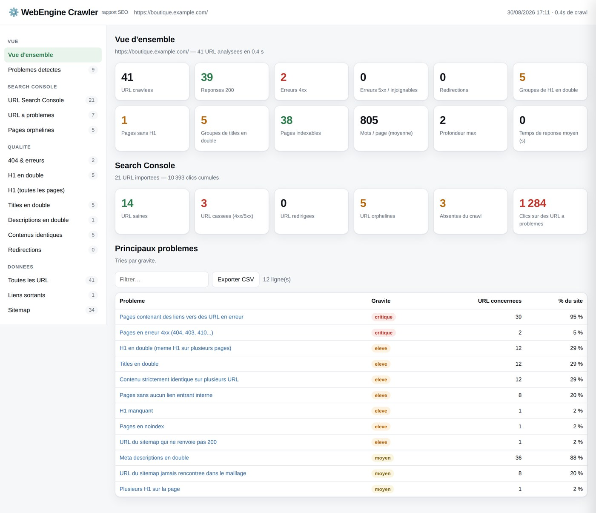
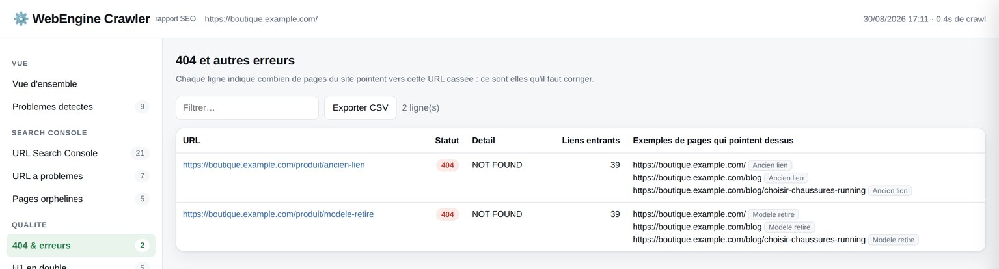
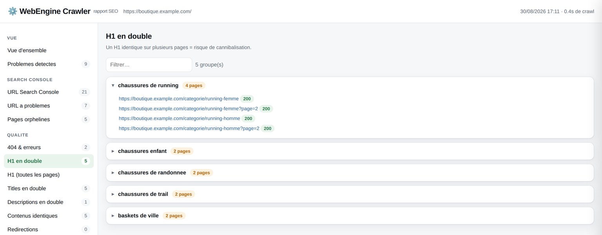
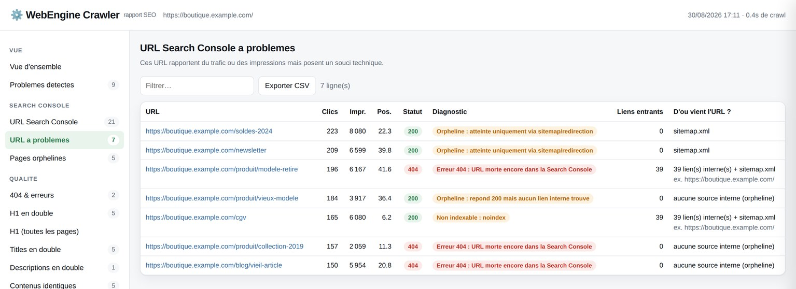
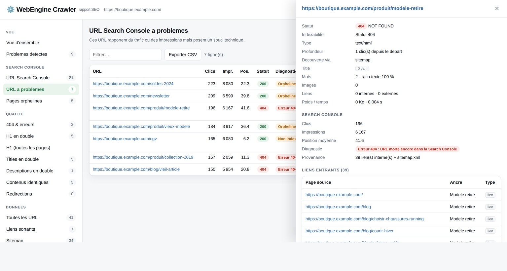

<h1 align="center">⚙️ WebEngine Crawler</h1>

<p align="center">
  <b>Le crawler SEO gratuit qui vous dit d'où viennent vos 404.</b><br>
  H1 en double · erreurs 404 avec leurs liens entrants · croisement Search Console<br>
  <i>Sans limite de 500 URL, sans compte, 100 % en local.</i>
</p>

<p align="center">
  <a href="#installation"></a>
  <a href="LICENSE"></a>
  
  
</p>


---

## Le problème

Votre Search Console remonte des URL. Certaines rapportent des clics **et renvoient une 404**.
D'autres sont **orphelines** : Google les connaît, mais aucun lien interne n'y mène.
Et pendant ce temps, trois gabarits de votre site partagent exactement le même H1.

Les outils gratuits s'arrêtent à 500 URL, ou vous listent les problèmes sans dire **quelle page corriger**.

## Ce que fait WebEngine Crawler

```
⚙️  WebEngine Crawler 1.0.0 — crawl de https://monsite.fr

  ── Résumé ──────────────────────────────────────────────
  URL crawlées ............ 41  (34 indexables)
  200 OK .................. 39
  Erreurs 4xx ............. 2
  Groupes de H1 en double . 5
  Titles en double ........ 5
  GSC : 21 URL — 3 cassées, 5 orphelines, 3 hors crawl
  ────────────────────────────────────────────────────────

  À traiter en priorité :
   • Pages contenant des liens vers des URL en erreur        39 URL
   • H1 en double (même H1 sur plusieurs pages)              12 URL
   • Pages sans aucun lien entrant interne                    8 URL

📄  Rapport : rapport-monsite.fr-20260830-1655.html
```

Puis un rapport HTML autonome s'ouvre dans votre navigateur.



### 1. Les 404 — et les pages qui pointent dessus

Pas seulement « cette URL est cassée », mais **quelle page contient le lien et avec quelle ancre**.



### 2. Les H1 en double, regroupés par valeur



### 3. Search Console : d'où vient cette URL ?

Déposez votre export : chaque URL est croisée avec le crawl. Statut réel, indexabilité,
et **provenance** — liens internes, sitemap, redirection… ou rien du tout.



Un clic sur n'importe quelle ligne ouvre la fiche complète de l'URL, avec **tous ses liens entrants** :



---

## Installation

```bash
git clone https://github.com/webenginefree/webengine-crawler
cd webengine-crawler
pip install -r requirements.txt
```

## Utilisation

**Interface web** — vous collez l'URL, vous déposez l'export Search Console, vous cliquez :

```bash
./webengine.sh serve        # http://127.0.0.1:5005
```

**Ligne de commande** :

```bash
# crawl simple
./webengine.sh crawl https://monsite.fr

# crawl complet + Search Console + exports CSV + sauvegarde
./webengine.sh crawl https://monsite.fr -n 5000 -t 10 --delay 0.2 \
    --gsc ~/Téléchargements/Pages.csv --csv ./exports --save crawl.json.gz

# rejouer un croisement Search Console sans re-crawler
./webengine.sh gsc crawl.json.gz ~/Téléchargements/nouvel-export.csv
```

Sous Windows, remplacez `./webengine.sh` par `python -m webengine`.

| Option | Effet |
|---|---|
| `-n, --max-pages` | nombre max d'URL (défaut 500) |
| `-t, --threads` | requêtes en parallèle (défaut 8) |
| `--delay 0.3` | pause entre requêtes, pour ménager un petit serveur |
| `--gsc FICHIER` | export Search Console à croiser (.csv, .zip, .txt) |
| `--include / --exclude` | limiter le crawl par expression régulière |
| `--subdomains` | inclure les sous-domaines |
| `--auth user:mdp` | authentification basique (préprod) |
| `--csv DOSSIER` | exporter tous les tableaux en CSV |
| `--save FICHIER` | sauvegarder le crawl pour le rejouer |

## Les 35+ contrôles

**Statuts** — 4xx, 5xx, timeouts, chaînes et boucles de redirection, pages liant vers une erreur
ou vers une redirection, liens sortants cassés.
**Contenu** — H1 manquant / vide / multiple / dupliqué / trop long, title et meta description
(manquants, dupliqués, trop longs, trop courts), contenus strictement identiques, contenu pauvre,
images sans alt.
**Indexabilité** — noindex, canonical absente, canonicalisée, canonical vers une URL non 200.
**Maillage** — pages sans lien entrant, pages profondes, URL du sitemap non 200 ou jamais maillées.
**Performance** — temps de réponse, poids, ratio texte/HTML.

## Ce que WebEngine Crawler ne fait pas

Pas de rendu JavaScript, pas d'analyse de logs, pas de connexion aux API Google, pas de comparaison
de crawls. Pour ça, [Screaming Frog](https://www.screamingfrog.co.uk/seo-spider/) reste la référence
et vaut largement sa licence. WebEngine Crawler couvre le besoin quotidien : structure, statuts, doublons,
maillage interne, Search Console.

## Documentation

La documentation complète est dans [docs/DOCUMENTATION.md](docs/DOCUMENTATION.md).
Pour héberger l'interface web derrière un reverse proxy avec authentification :
[docs/DEPLOIEMENT.md](docs/DEPLOIEMENT.md).

## Contribuer

Les issues et les pull requests sont bienvenues. Si l'outil vous fait gagner du temps,
une ⭐ aide les autres à le trouver.

## Licence

MIT — faites-en ce que vous voulez.

<sub>Screaming Frog est une marque déposée de Screaming Frog Ltd. WebEngine Crawler n'est ni affilié,
ni approuvé, ni sponsorisé par Screaming Frog Ltd. Les captures présentent un site de démonstration.</sub>
